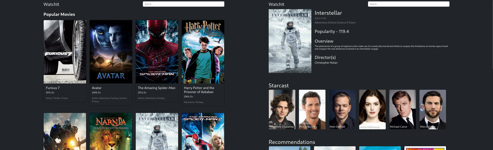

# Content Based Movie Recommendation
## Screenshots of the Web App

 

# Data Collection

I collected over 3000 movie data from an api provided by [TMDB](https://www.themoviedb.org/)

### Sample Data

<table border="1" class="dataframe">
    <thead>
        <tr style="text-align: right;">
            <th></th>
            <th>id</th>
            <th>title</th>
            <th>genres</th>
            <th>overview</th>
            <th>adult</th>
            <th>release_year</th>
            <th>poster_url</th>
            <th>keywords</th>
            <th>cast</th>
            <th>director</th>
            <th>popularity</th>
        </tr>
    </thead>
    <tbody>
        <tr>
            <th>95</th>
            <td>157336</td>
            <td>Interstellar</td>
            <td>[Adventure, Drama, Science Fiction]</td>
            <td>The adventures of a group of explorers who make use of a newly discovered wormhole...
            </td>
            <td>False</td>
            <td>2014</td>
            <td>https://image.tmdb.org/t/p/w500/gEU2QniE6E77NI6lCU6MxlNBvIx.jpg</td>
            <td>[artificial intelligence, nasa, time warp, spacecraft, expedition, future,...</td>
            <td>[[Matthew McConaughey, /sY2mwpafcwqyYS1sOySu1MENDse.jpg], [Timothée Chalamet,
                /BE2sdjpgsa2rNTFa66f7upkaOP.jpg]...</td>
            <td>[[Christopher Nolan, /xuAIuYSmsUzKlUMBFGVZaWsY3DZ.jpg]]</td>
            <td>128.429</td>
        </tr>
    </tbody>
</table>

# Feature Extraction

After a bit more cleaning of the collected data, i created a column named 'tags' which contains string version of the genres, overview, kewords, cast & director all are seperated by space(' ').<br>
Then i used the <b>Stemming technique</b>, after i applied the <b>CountVectorization</b> technique with <b>6000 features</b>, thus i created the <b>features vector</b>.

# Recommendation

There are many ways we can recommend based on content, i used <b>cosine similarity</b> to recommend.<br>
Some other ways include <b>K-Nearest-Neighbour</b> and <b>ANNOY(Approximate Nearest Neighbors)</b> from Spotify.


## Data Links

|file name            |description                     |link                                                                                                 |
|---------------------|--------------------------------|-----------------------------------------------------------------------------------------------------|
|similarity_df.parquet|calculated similarity data frame|https://github.com/rohit-krish/Movie-Recommendation/raw/main/app/website/static/similarity_df.parquet|
|combined.parquet     |collected data                  |https://github.com/rohit-krish/Movie-Recommendation/raw/main/data/combined.parquet                   |

## How to use?

```
git clone git@github.com:rohit-krish/Movie-Recommendation.git
```

```
cd Movie-Recommendation
pip install -r ./requirements.txt
```

<b>Before any thing you should create an account in [TMDB](https://developer.themoviedb.org/docs/getting-started) and paste you API KEY into a .env file</b>

```
echo "API_KEY=<your_api_key>" > .env
```

```
cd app
python main.py
```

## TODO

- [x] increase the initial movie options
- [x] implement the search feature
- [x] search box width problem in mobile phone size
- [x] pictures in mobile phone size is too large
- [x] add placeholders before loading the complete UI
